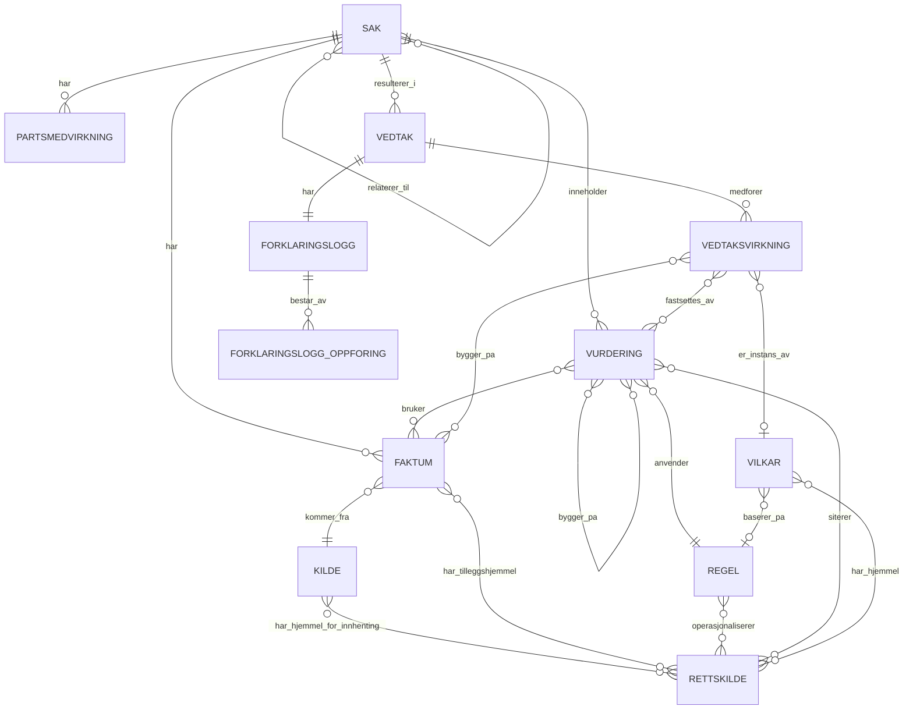

# Forklaringsmodell API

ASP.NET Core Web API som lar en saksbehandlingsløsning fylle ut og lese ut informasjonsmodellen som **forklarer et vedtak** — kombinasjonen av forvaltningsloven § 25 (begrunnelse) og digital-rettsstats lag for automatisert forklaring (Kildelaget, Datalaget, Regellaget).

Modellen dokumenterer et vedtak uavhengig av om vurderingen bak er deterministisk regelanvendelse, en generativ KI-vurdering eller et menneskelig skjønn — og uavhengig av om faktum er strukturert/ustrukturert eller kommer fra en autoritativ kilde.

**Kjerneprinsipp:** `Sak` er en levende saksmappe. `Vedtak` og `Forklaringslogg` er et frosset øyeblikksbilde. Alt som er referert av et frosset `Vedtak` er *append-only* — korrigeringer skjer ved å legge til nye rader, aldri ved å endre eksisterende.

Full spesifikasjon: [`docs/api-spesifikasjon-forklaringsmodell.md`](docs/api-spesifikasjon-forklaringsmodell.md). Versjonshistorikk: [`CHANGELOG.md`](CHANGELOG.md).

## Domenemodell



| Entitet | Rolle |
|---|---|
| `Sak` | Levende saksmappe. Utløst av en `HendelseType` (søknad, melding, klage …). |
| `Faktum` | Rått eller subsumert data om saken, med kildehenvisning og evt. rettslig tilleggshjemmel. |
| `Kilde` / `Rettskilde` | Hvor et faktum kom fra / hvilken lov, forskrift eller rundskriv som er hjemmel. |
| `Regel` | Operasjonalisert regelversjon (DMN, Python, LLM-prompt …), koblet til én eller flere rettskilder. |
| `Vurdering` | Resultatet av å anvende en `Regel` på fakta — deterministisk, generativ KI eller skjønn. Har alltid et `Utfall` (også når vilkåret ikke faktisk ble vurdert). |
| `Vedtak` / `Forklaringslogg` | Det frosne øyeblikksbildet: hvilke faktum/vurderinger/partsmedvirkninger som forklarer utfallet. |
| `Vedtaksvirkning` | En konkret virkning av vedtaket (tillatelse, plikt, ytelse, gebyr), evt. instans av en katalogført `Vilkar`. |
| `Vilkar` | Gjenbrukbar vilkårskatalog (som `Regel`) — rettslig, intern praksis eller teknisk/datakvalitet-forankret. |
| `SakRelasjon` | Kobler en oppfølgende sak til en relatert sak, uten å modifisere den. |

## Forretningsregler (utvalg)

Alle 16 regler er beskrevet i spesifikasjonen; de viktigste prinsippene:

- **Append-only etter frysing** — ingen `PUT`/`DELETE` på `Vedtak`, `Forklaringslogg` eller `Vedtaksvirkning`. Alt som refereres i en frosset forklaringslogg blir skrivebeskyttet.
- **Skjønn må forklares** — `Hovedhensyn` er obligatorisk når `Vurdering.Type == Skjonn`.
- **`AutomatiseringsGrad` beregnes serverside**, ikke av klienten, fra andelen skjønn/eskalerte vurderinger.
- **Kryss-sak-referanser er alltid skrivebeskyttede** — en vurdering kan lese fra en annen (allerede frosset) sak, men aldri endre den.
- **Referansedata (`Regel`, `Vilkar`) er append-only** når de er tatt i bruk — nye versjoner opprettes som nye rader.

## Arkitektur

Lagdelt .NET 8-løsning:

```
src/
  Forklaringsmodell.Domain          Entiteter, enumer, forretningsregler
  Forklaringsmodell.Application     DTO-er, FluentValidation, use-case-services
  Forklaringsmodell.Infrastructure  EF Core, migrasjoner, repository, seed-data
  Forklaringsmodell.Api             Kontrollere, Swagger, Program.cs
tests/
  Forklaringsmodell.Tests           Enhets- og integrasjonstester (xUnit)
```

EF Core mot SQLite lokalt (`Data Source=forklaringsmodell.db`) — PostgreSQL/SQL Server for reell drift.

## Kom i gang

```bash
dotnet build
dotnet test
```

Kjør API-et (migrerer og seeder databasen automatisk i utviklingsmiljø):

```bash
dotnet run --project src/Forklaringsmodell.Api
```

Swagger-UI åpnes på `https://localhost:7151/swagger` (eller `http://localhost:5013/swagger`), og gir en fullstendig, utprøvbar oversikt over alle endepunkter.

Seed-dataen setter opp et komplett dagpenger-eksempel (sak, faktum, vurderinger med alle `Utfall`-typer, vedtak med virkning) pluss en oppfølgende sak som demonstrerer sak-relasjoner og kryss-sak-referanser — klar for manuell utforskning rett etter oppstart.

## API-endepunkter

| Metode | Sti | Beskrivelse |
|---|---|---|
| GET/POST | `/api/saker` | List / opprett sak |
| GET/PUT | `/api/saker/{id}` | Les / oppdater sak |
| GET/POST | `/api/saker/{sakId}/relasjoner` | List / opprett saksrelasjon |
| GET/POST | `/api/saker/{sakId}/faktum` | List / registrer faktum |
| POST | `/api/faktum/{id}/transformer` | Opprett subsumert faktum avledet fra et rått faktum |
| GET | `/api/faktum/{id}` | Les ett faktum |
| GET/POST | `/api/kilder` | Kilde (referansedata) |
| GET/POST | `/api/rettskilder` | Rettskilde (referansedata) |
| GET/POST | `/api/regler` | Regel (referansedata) |
| GET/POST | `/api/vilkar` | Vilkår (referansedata) |
| GET/POST | `/api/saker/{sakId}/vurderinger` | List / registrer vurdering |
| GET | `/api/vurderinger/{id}` | Les én vurdering |
| GET/POST | `/api/saker/{sakId}/partsmedvirkning` | List / registrer partsmedvirkning |
| POST | `/api/saker/{sakId}/vedtak` | Opprett vedtak (fryser forklaringslogg + virkninger) |
| GET | `/api/vedtak/{id}` | Les vedtaket |
| GET | `/api/vedtak/{id}/forklaring` | Hydrert forklaring — alt utfoldet |
| GET | `/api/vedtak/{id}/virkninger` | List vedtaksvirkninger |

Se spesifikasjonen for fullstendige request/response-skjemaer og valideringsregler.
