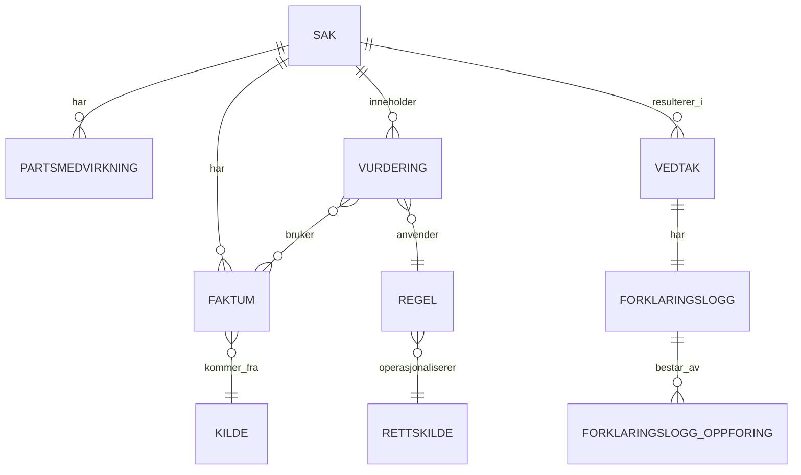

# Spesifikasjon: API for forklaringsmodell (vedtak, faktum, regel, vurdering)

Mål for Claude Code: sette opp en ASP.NET Core Web API som lar en saksbehandlingsløsning fylle ut og lese ut informasjonsmodellen som forklarer et vedtak — kombinasjonen av forvaltningsloven § 25 (begrunnelse) og digital-rettsstats lag for automatisert forklaring (Kildelaget, Datalaget, Regellaget).

## 1. Bakgrunn

Modellen skal kunne dokumentere et vedtak uavhengig av om vurderingen som ligger til grunn er deterministisk regelanvendelse, en generativ KI-vurdering, eller et menneskelig skjønn — og uavhengig av om faktum er strukturert/ustrukturert eller kommer fra en autoritativ/ikke-autoritativ kilde. Kjerneprinsippet: `Sak` er en levende saksmappe, `Vedtak` og `Forklaringslogg` er et frosset øyeblikksbilde. Alt som er referert av en frosset `Vedtak` er append-only — korrigeringer skjer ved å legge til nye rader, ikke ved å endre eksisterende.

## 2. Domenemodell



`FORKLARINGSLOGG_OPPFORING` er en generisk referanserad (`OppforingsType`: Faktum / Vurdering / Partsmedvirkning + `ReferanseId`) som gjør at loggen kan peke på nøyaktig hvilke rader som forklarer vedtaket, uten å måtte modellere tre separate mange-til-mange-tabeller.

### Enumer

```csharp
public enum FaktumType { Raatt, Subsumert }
public enum StrukturType { Strukturert, Ustrukturert }
public enum KildeType { AutoritativtRegister, Soknad, TredjepartsUttalelse, AnnenKilde }
public enum VurderingsType { Deterministisk, GenerativKI, Skjonn }
public enum AutomatiseringsGrad { Helautomatisert, DelvisAutomatisert, Manuell }
public enum PartsmedvirkningType { Forhaandsvarsel, Kommentar, InnsynsKrav }
public enum OppforingsType { Faktum, Vurdering, Partsmedvirkning }
public enum SakStatus { UnderBehandling, Avsluttet, Klaget }
```

### Entiteter (POCO-skisse, ikke ferdig EF-konfigurasjon)

```csharp
public class Sak
{
    public Guid SakId { get; set; }
    public string Tittel { get; set; }
    public SakStatus Status { get; set; }
    public DateTimeOffset Opprettet { get; set; }
    public DateTimeOffset SistEndret { get; set; }
}

public class Kilde
{
    public Guid KildeId { get; set; }
    public string Navn { get; set; }
    public KildeType Type { get; set; }
    public bool Autoritativ { get; set; }
}

public class Faktum
{
    public Guid FaktumId { get; set; }
    public Guid SakId { get; set; }
    public Guid KildeId { get; set; }
    public FaktumType Type { get; set; }
    public StrukturType Struktur { get; set; }
    public string Verdi { get; set; }              // fritekst eller JSON for strukturerte fakta
    public Guid? AvledetFraFaktumId { get; set; }   // selvreferanse: transformasjonsspor
    public DateTimeOffset InnhentetTidspunkt { get; set; }
}

public class Rettskilde
{
    public Guid RettskildeId { get; set; }
    public string Paragraf { get; set; }
    public DateTimeOffset VersjonDato { get; set; }
    public string EliReferanse { get; set; }
}

public class Regel
{
    public Guid RegelId { get; set; }
    public Guid RettskildeId { get; set; }
    public string Teknologi { get; set; }           // f.eks. "DMN", "Python", "LLM-prompt v3"
    public VurderingsType Type { get; set; }        // regelens konfigurerte type
}

public class Vurdering
{
    public Guid VurderingId { get; set; }
    public Guid SakId { get; set; }
    public Guid RegelId { get; set; }
    public VurderingsType Type { get; set; }        // faktisk brukt type (kan avvike fra Regel.Type ved eskalering)
    public string Beregningsspor { get; set; }
    public decimal? Konfidens { get; set; }         // 0.0–1.0, kun relevant for GenerativKI
    public bool Eskalert { get; set; }
    public string Hovedhensyn { get; set; }         // obligatorisk når Type == Skjonn
    public string ForkastedeUtfall { get; set; }    // kontrastiv forklaring for skjønn
    public ICollection<Guid> FaktumIder { get; set; } // mange-til-mange via VurderingFaktum
}

public class Partsmedvirkning
{
    public Guid MedvirkningId { get; set; }
    public Guid SakId { get; set; }
    public PartsmedvirkningType Type { get; set; }
    public DateTimeOffset Tidspunkt { get; set; }
    public string Innhold { get; set; }
}

public class Vedtak
{
    public Guid VedtakId { get; set; }
    public Guid SakId { get; set; }
    public DateTimeOffset Tidspunkt { get; set; }
    public string Utfall { get; set; }
    public AutomatiseringsGrad AutomatiseringsGrad { get; set; }
}

public class Forklaringslogg
{
    public Guid LoggId { get; set; }
    public Guid VedtakId { get; set; }
    public ICollection<ForklaringsloggOppforing> Oppforinger { get; set; }
}

public class ForklaringsloggOppforing
{
    public Guid OppforingId { get; set; }
    public Guid LoggId { get; set; }
    public OppforingsType Type { get; set; }
    public Guid ReferanseId { get; set; }
}
```

## 3. Forretningsregler (viktigst — implementer disse, ikke bare skjemaet)

1. **Append-only etter frysing.** Når en `Vedtak` er opprettet, kan verken `Vedtak` eller den tilhørende `Forklaringslogg` endres eller slettes (kun `GET`/`POST`, ingen `PUT`/`DELETE`). Enhver `Faktum`, `Vurdering` eller `Partsmedvirkning` som er referert i en `ForklaringsloggOppforing`, blir også skrivebeskyttet — en korrigering skal opprette en ny rad, der `Faktum.AvledetFraFaktumId` peker til den opprinnelige.
2. **Skjønn må alltid forklares.** Hvis `Vurdering.Type == Skjonn`, er `Hovedhensyn` et obligatorisk felt (valider på API-nivå, ikke bare i databasen). `ForkastedeUtfall` bør også fylles ut der det er relevante alternativer.
3. **Konfidens er domenevalidert.** `Konfidens` skal være mellom 0 og 1, og bør kun være satt når `Type == GenerativKI` eller en annen statistisk vurderingstype. Terskel for eskalering er ikke en hardkodet konstant i API-et, men bør leses fra konfigurasjon per `Regel`.
4. **Regelspeil er også append-only.** En `Regel`-rad som er referert av minst én `Vurdering`, skal ikke overskrives — nye versjoner av regeloperasjonaliseringen opprettes som nye `Regel`-rader, koblet til samme eller oppdatert `Rettskilde`.
5. **`Vedtak.AutomatiseringsGrad` skal reflektere faktisk fordeling** mellom automatiserte og manuelle `Vurdering`-rader i saken, ikke settes fritt av klienten — beregn den serverside ut fra andelen `Vurdering` med `Type == Skjonn` og `Eskalert == true`.
6. **`Sak` er mutable helt til `Vedtak` finnes**, men kan fortsatt få nye `Vedtak` senere (f.eks. ved klage/omgjøring) — det skal derfor være mulig å opprette flere `Vedtak` per `Sak` over tid, hver med sin egen `Forklaringslogg`.

## 4. Foreslått løsningsarkitektur (.NET)

- ASP.NET Core Web API (.NET 8+), C#.
- EF Core mot PostgreSQL eller SQL Server (foreslå SQLite kun for lokal utvikling/tester).
- Lagdeling: `Domain` (entiteter + forretningsregler over), `Application` (DTO-er, validering, use cases), `Infrastructure` (EF Core, repositories), `Api` (kontrollere, OpenAPI).
- `FluentValidation` eller innebygd `DataAnnotations` for reglene i punkt 3.2–3.3.
- Swagger/OpenAPI generert automatisk (`Microsoft.AspNetCore.OpenApi` eller `Swashbuckle`).
- Immutabilitet (punkt 3.1 og 3.4) implementeres som et sjekk i `Application`-laget før `Update`/`Delete` kalles — ikke stol på at kontrolleren aldri eksponerer disse verbene, siden fremtidige klienter kan legge dem til.

## 5. API-endepunkter

| Metode | Sti | Beskrivelse |
|---|---|---|
| GET/POST | `/api/saker` | List / opprett sak |
| GET/PUT | `/api/saker/{id}` | Les / oppdater sak (status, tittel) |
| GET/POST | `/api/saker/{sakId}/faktum` | List / registrer faktum på en sak |
| POST | `/api/faktum/{id}/transformer` | Opprett nytt subsumert faktum avledet fra et rått faktum (setter `AvledetFraFaktumId` automatisk) |
| GET | `/api/faktum/{id}` | Les ett faktum |
| GET/POST | `/api/kilder` | List / registrer kilde (referansedata) |
| GET/POST | `/api/rettskilder` | List / registrer rettskilde (referansedata) |
| GET/POST | `/api/regler` | List / registrer regel (referansedata, koblet til rettskilde) |
| GET/POST | `/api/saker/{sakId}/vurderinger` | List / registrer vurdering på en sak |
| GET | `/api/vurderinger/{id}` | Les én vurdering |
| GET/POST | `/api/saker/{sakId}/partsmedvirkning` | List / registrer partsmedvirkning |
| POST | `/api/saker/{sakId}/vedtak` | Opprett vedtak — se body-skjema under |
| GET | `/api/vedtak/{id}` | Les vedtaket (grunndata) |
| GET | `/api/vedtak/{id}/forklaring` | Les hydrert forklaring: vedtak + alle refererte faktum/vurdering/partsmedvirkning-rader utfoldet |

Ingen `DELETE` på `vedtak`, `forklaringslogg`-relaterte ressurser. `PUT`/`DELETE` på `faktum`, `vurderinger`, `regler` skal avvises (409/423) dersom raden allerede er referert av en `ForklaringsloggOppforing`.

**Body for `POST /api/saker/{sakId}/vedtak`:**

```json
{
  "utfall": "Dagpenger tilkjent",
  "faktumIder": ["<guid>", "<guid>"],
  "vurderingIder": ["<guid>", "<guid>"],
  "partsmedvirkningIder": ["<guid>"]
}
```

Serveren bygger `Forklaringslogg` og dens `ForklaringsloggOppforing`-rader fra disse listene, beregner `AutomatiseringsGrad` fra de refererte `Vurdering`-radene (regel 3.5), og fryser alt i samme transaksjon.

## 6. Eksempeldata (fra dagpenger-eksempelet)

```json
{
  "sak": { "tittel": "Søknad om dagpenger", "status": "UnderBehandling" },
  "faktum": [
    { "type": "Raatt", "struktur": "Strukturert", "verdi": "420000", "kilde": { "navn": "A-ordningen", "type": "AutoritativtRegister", "autoritativ": true } },
    { "type": "Raatt", "struktur": "Ustrukturert", "verdi": "Fikk ikke fornyet vikariat, arbeidsgiver nedbemannet", "kilde": { "navn": "Søknad", "type": "Soknad", "autoritativ": false } }
  ],
  "vurderinger": [
    { "type": "Deterministisk", "beregningsspor": "inntekt >= 1.5G => oppfylt", "eskalert": false },
    { "type": "GenerativKI", "konfidens": 0.62, "eskalert": true, "beregningsspor": "klassifisert som 'uklar'" },
    { "type": "Skjonn", "hovedhensyn": "Dokumentert nedbemanning hos arbeidsgiver", "forkastedeUtfall": "Selvforskyldt oppsigelse" }
  ],
  "vedtak": { "utfall": "Dagpenger tilkjent", "automatiseringsGrad": "DelvisAutomatisert" }
}
```

## 7. Ikke-funksjonelle krav

- OpenAPI-spesifikasjon eksponert på `/swagger` i utviklingsmiljø.
- Enhetstester for forretningsreglene i punkt 3 (spesielt: skjønn uten hovedhensyn skal gi valideringsfeil; forsøk på å endre et referert faktum skal gi 409/423; forsøk på `PUT`/`DELETE` på vedtak skal gi 405).
- Migreringer via EF Core (`dotnet ef migrations`), ikke manuelt SQL.
- Autentisering er ikke spesifisert her — legg inn som eget punkt når løsningen skal kobles til ID-porten/Maskinporten for reell bruk.

## 8. Leveranse (definition of done)

- Kjørbart .NET-prosjekt med de lagene i punkt 4.
- Alle endepunkter i punkt 5 implementert og dokumentert i Swagger.
- Forretningsreglene i punkt 3 dekket av enhetstester.
- Seed-data fra punkt 6 kjørbar via en enkel seed-kommando eller migrasjon, for manuell verifisering.

---

*Denne spesifikasjonen er avledet fra en ER-modell utviklet i samtale med Claude, og kan legges i `docs/` i `digital-rettsstat`-repoet. Be Claude Code sette opp prosjektstrukturen med utgangspunkt i punkt 4–6, og verifisere forretningsreglene i punkt 3 med tester før videre utbygging.*
