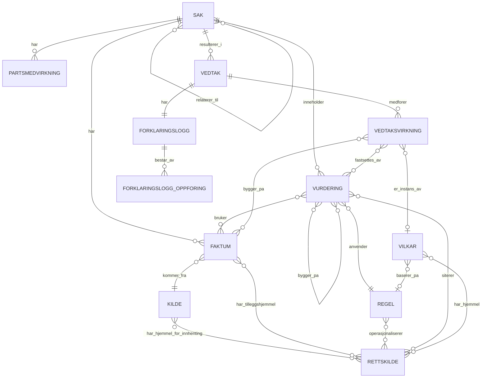

# Spesifikasjon: API for forklaringsmodell (vedtak, faktum, regel, vurdering)

Mål for Claude Code: sette opp en ASP.NET Core Web API som lar en saksbehandlingsløsning fylle ut og lese ut informasjonsmodellen som forklarer et vedtak — kombinasjonen av forvaltningsloven § 25 (begrunnelse) og digital-rettsstats lag for automatisert forklaring (Kildelaget, Datalaget, Regellaget).

## 1. Bakgrunn

Modellen skal kunne dokumentere et vedtak uavhengig av om vurderingen som ligger til grunn er deterministisk regelanvendelse, en generativ KI-vurdering, eller et menneskelig skjønn — og uavhengig av om faktum er strukturert/ustrukturert eller kommer fra en autoritativ/ikke-autoritativ kilde. Kjerneprinsippet: `Sak` er en levende saksmappe, `Vedtak` og `Forklaringslogg` er et frosset øyeblikksbilde. Alt som er referert av en frosset `Vedtak` er append-only — korrigeringer skjer ved å legge til nye rader, ikke ved å endre eksisterende.

## 2. Domenemodell



`FORKLARINGSLOGG_OPPFORING` er en generisk referanserad (`OppforingsType`: Faktum / Vurdering / Partsmedvirkning + `ReferanseId`) som gjør at loggen kan peke på nøyaktig hvilke rader som forklarer vedtaket, uten å måtte modellere tre separate mange-til-mange-tabeller.

`Rettskilde` er bevisst **ikke** koblet til `Sak` — den kobles kun via `Regel` (den generelle, stående hjemmelen for regelkonstruksjonen) og direkte via `Vurdering` (saksspesifikke kilder, typisk brukt for skjønn der en saksbehandler siterer en konkret dom eller rundskriv-passasje som ikke er del av den stående regelen). Begge koblinger er mange-til-mange, siden en regel eller vurdering ofte bygger på flere kildetyper samtidig (lov + forskrift + rundskriv).

Innhenting av faktum er også en hjemmelsregulert handling, atskilt fra hjemmelen for selve regelanvendelsen. Samme mønster gjenbrukes: `Kilde` har en stående hjemmel for innhenting (satt én gang når kildetilgangen/integrasjonen etableres, gjenbrukt av alle faktum fra den kilden), og `Faktum` kan i tillegg ha en tilleggshjemmel når én konkret innhenting krever noe mer enn kildens standardhjemmel — for eksempel innhenting av særlige kategorier personopplysninger.

Ett vedtak kan medføre flere, uavhengig tidsbegrensede virkninger samtidig — en tillatelse med egen gyldighetsperiode, en løpende plikt, et beløp avhengig av et faktum. `Vedtaksvirkning` fanger dette som egne rader under `Vedtak`, hver med sin egen varighet og sporbar kobling til hvilken `Vurdering`/`Faktum` som fastsatte den.

Mange virkninger er ikke unike for én sak — samme vilkårstekst, samme parametriserte beregning eller samme rettslige hjemmel går igjen på tvers av tusenvis av vedtak av samme type. `Vilkar` er en generell referansetabell (som `Regel`/`Rettskilde`/`Kilde`) for slike gjenbrukbare vilkårsdefinisjoner — den er bevisst *ikke* begrenset til statiske standardvilkår, men kan romme alt fra en fast, alltid-gjeldende betingelse til en parametrisert eller skjønnsbasert vilkårstype. `Vedtaksvirkning.VilkarId` er valgfri: sett den når virkningen er en instans av noe katalogført, la den stå null for helt skreddersydde virkninger. Selve `Vedtaksvirkning`-raden er uansett den autoritative posten for hva som faktisk gjaldt i det konkrete vedtaket — endres `Vilkar`-katalogoppføringen senere, skal ikke allerede opprettede `Vedtaksvirkning`-rader påvirkes (samme append-only-prinsipp som for `Regel`, se punkt 3.4).

Denne modellen skal **ikke** modellere saksflyt eller tilstandsoverganger — det er en CPSV-AP-hendelse (søknad, innrapportering, tilbakekall, melding) som utløser en *ny* `Sak`, og den nye saken kan lese fra en relatert sak uten å modifisere den. `Sak.UtlosendeHendelse` merker hvorfor saken oppstod, `SakRelasjon` kobler den til en sak den følger opp, og `Vurdering.RefererteVurderingIder` lar en ny vurdering eksplisitt bygge på en vurdering fra en annen (allerede frosset) sak — for eksempel når en melding om endret inntekt utløser en ny vurdering på nytt faktum, i sin egen sak, som gjenbruker den opprinnelige vurderingen av grunnvilkåret. Tilsvarende kan én `Vedtaksvirkning` være avledet av en annen — f.eks. et serveringssteds åpningstid låst til en tilknyttet skjenkebevillings skjenketid — via `Vedtaksvirkning.AvledetFraVirkningId`, som kan peke på tvers av både `Vedtak` og `Sak`.

### Enumer

```csharp
public enum FaktumType { Raatt, Subsumert }
public enum StrukturType { Strukturert, Ustrukturert }
public enum KildeType { AutoritativtRegister, Soknad, TredjepartsUttalelse, AnnenKilde }
public enum RettskildeType { Lov, Forskrift, Rundskriv, Forarbeider, Rettspraksis, InternasjonalRett, Forvaltningspraksis }
public enum VurderingsType { Deterministisk, GenerativKI, Skjonn }
public enum UtfallType { Oppfylt, IkkeOppfylt, Uaktuelt, IkkeVurdert, Uavklart }
public enum GrunnlagsType { Rettslig, InternPraksis, Datakvalitet }
public enum AutomatiseringsGrad { Helautomatisert, DelvisAutomatisert, Manuell }
public enum PartsmedvirkningType { Forhaandsvarsel, Kommentar, InnsynsKrav }
public enum OppforingsType { Faktum, Vurdering, Partsmedvirkning }
public enum SakStatus { UnderBehandling, Avsluttet, Klaget }
public enum VirkningType { Tillatelse, Plikt, OkonomiskYtelse, Tilskudd, Gebyr }
public enum FastsettelsesmateType { Statisk, Parametrisert, Skjonnsbasert, Avledet }
public enum VarighetsType { Tidsbegrenset, Varig, LopendeInntilVilkarBrister }
public enum HendelseType { Soknad, Innrapportering, Melding, Tilbakekall, Kontroll, Klage, Omgjoring }
public enum SakRelasjonType { Tilbakekall, Revurdering, OppfolgingAvMelding, Klage, Kontroll, Annet }
```

### Entiteter (POCO-skisse, ikke ferdig EF-konfigurasjon)

```csharp
public class Sak
{
    public Guid SakId { get; set; }
    public string Tittel { get; set; }
    public SakStatus Status { get; set; }
    public DateTimeOffset Opprettet { get; set; }
    public DateTimeOffset SistEndret { get; set; }
    public string CpsvTjenesteReferanse { get; set; } // IRI til cpsvno:Service i CPSV-AP-NO, valgfri
    public HendelseType UtlosendeHendelse { get; set; } // hvilken hendelse på tjenesten som utløste denne saken
}

public class SakRelasjon
{
    public Guid RelasjonId { get; set; }
    public Guid SakId { get; set; }           // den nye/oppfølgende saken
    public Guid RelatertSakId { get; set; }   // saken den følger opp/relaterer til
    public SakRelasjonType Type { get; set; }
}

public class Kilde
{
    public Guid KildeId { get; set; }
    public string Navn { get; set; }
    public KildeType Type { get; set; }
    public bool Autoritativ { get; set; }
    public ICollection<Guid> RettskildeIder { get; set; } // hjemmel for innhenting fra denne kilden, se punkt 3.8
    public string CccevReferanse { get; set; } // IRI til cccev:Evidence eller cccev:Criterion, valgfri
}

public class Faktum
{
    public Guid FaktumId { get; set; }
    public Guid SakId { get; set; }
    public Guid KildeId { get; set; }
    public FaktumType Type { get; set; }
    public StrukturType Struktur { get; set; }
    public string Verdi { get; set; }              // fritekst eller JSON for strukturerte fakta
    public Guid? AvledetFraFaktumId { get; set; }   // selvreferanse: transformasjonsspor
    public DateTimeOffset InnhentetTidspunkt { get; set; }
    public ICollection<Guid> RettskildeIder { get; set; } // tilleggshjemmel utover Kilde, se punkt 3.8
}

public class Rettskilde
{
    public Guid RettskildeId { get; set; }
    public RettskildeType Type { get; set; }
    public string Henvisning { get; set; }          // f.eks. "folketrygdloven § 4-5", "NOU 2019:5", "Rt-2015-1234"
    public DateTimeOffset? VersjonDato { get; set; } // kun meningsfullt for Lov/Forskrift
    public string EliReferanse { get; set; }         // kun meningsfullt for Lov/Forskrift
}

public class Regel
{
    public Guid RegelId { get; set; }
    public ICollection<Guid> RettskildeIder { get; set; } // mange-til-mange, se punkt 3.7
    public string Teknologi { get; set; }           // f.eks. "DMN", "Python", "LLM-prompt v3"
    public VurderingsType Type { get; set; }        // regelens konfigurerte type
    public string CpsvRegelReferanse { get; set; }  // IRI til cpsvno:Rule i CPSV-AP-NO, valgfri
    public string RegeldefinisjonReferanse { get; set; } // URI til selve regelartefaktet (f.eks. DMN-XML i et regelrepo), valgfri — se punkt 3.16
}

public class Vurdering
{
    public Guid VurderingId { get; set; }
    public Guid SakId { get; set; }
    public Guid RegelId { get; set; }
    public VurderingsType Type { get; set; }        // faktisk brukt type (kan avvike fra Regel.Type ved eskalering)
    public UtfallType Utfall { get; set; }          // Oppfylt/IkkeOppfylt/Uaktuelt/IkkeVurdert — se punkt 3.14
    public string Beregningsspor { get; set; }      // kan være strukturert JSON (input/output/mellomverdier), ikke bare fritekst
    public decimal? Konfidens { get; set; }         // 0.0–1.0, kun relevant for GenerativKI
    public bool Eskalert { get; set; }
    public string Hovedhensyn { get; set; }         // obligatorisk når Type == Skjonn
    public string ForkastedeUtfall { get; set; }    // kontrastiv forklaring for skjønn
    public ICollection<Guid> FaktumIder { get; set; }     // mange-til-mange via VurderingFaktum — kan peke til Faktum i en annen Sak, se punkt 3.11
    public ICollection<Guid> RettskildeIder { get; set; } // saksspesifikke kilder ut over Regel — se punkt 3.7
    public ICollection<Guid> RefererteVurderingIder { get; set; } // vurderinger fra andre (frosne) saker denne bygger på, se punkt 3.11
}

public class Partsmedvirkning
{
    public Guid MedvirkningId { get; set; }
    public Guid SakId { get; set; }
    public PartsmedvirkningType Type { get; set; }
    public DateTimeOffset Tidspunkt { get; set; }
    public string Innhold { get; set; }
}

public class Vedtak
{
    public Guid VedtakId { get; set; }
    public Guid SakId { get; set; }
    public DateTimeOffset Tidspunkt { get; set; }
    public string Utfall { get; set; }
    public AutomatiseringsGrad AutomatiseringsGrad { get; set; }
}

public class Vedtaksvirkning
{
    public Guid VirkningId { get; set; }
    public Guid VedtakId { get; set; }
    public Guid? VilkarId { get; set; }                   // valgfri kobling til katalogen, se Vilkar under
    public VirkningType Type { get; set; }
    public FastsettelsesmateType Fastsettelsesmate { get; set; } // hvordan innholdet ble fastsatt: statisk, parametrisert, skjønnsbasert eller avledet
    public string Beskrivelse { get; set; }              // f.eks. "Skjenkebevilling", "Innrapportering av omsetning", "Flerbarnstillegg"
    public VarighetsType Varighet { get; set; }
    public DateTimeOffset? GyldigFra { get; set; }
    public DateTimeOffset? GyldigTil { get; set; }        // skal være null når Varighet == Varig
    public decimal? Belop { get; set; }                   // for OkonomiskYtelse/Tilskudd (til mottaker) eller Gebyr (fra mottaker)
    public string LopendeVilkar { get; set; }             // vilkår som må fortsette å være oppfylt, f.eks. "varig funksjonsnedsettelse"
    public string RapporteringsFrekvens { get; set; }     // f.eks. "Kvartalsvis" — kun relevant når Type == Plikt
    public Guid? AvledetFraVirkningId { get; set; }       // selvreferanse, kan peke på tvers av Vedtak/Sak — kat. E: avledet av en annen bevilling
    public ICollection<Guid> VurderingIder { get; set; }  // hvilke(n) vurdering(er) fastsatte denne virkningen
    public ICollection<Guid> FaktumIder { get; set; }     // f.eks. "antall barn" — sporbarhet for beløpsberegning
}

public class Vilkar
{
    public Guid VilkarId { get; set; }
    public string Navn { get; set; }                      // f.eks. "Innrapporteringsplikt for omsetning", "Skjenketid gruppe 3 innendørs"
    public string Kode { get; set; }                       // f.eks. "FP_VK_41", strukturert kode fra kildesystemets kodeverk
    public string Kodeverk { get; set; }                   // f.eks. "VILKAR_TYPE" — hvilket kodeverk Kode er hentet fra
    public VirkningType Type { get; set; }                 // typisk/forventet type for dette vilkåret
    public GrunnlagsType Grunnlagstype { get; set; }       // rettslig / intern praksis / datakvalitet — se punkt 3.15
    public FastsettelsesmateType Fastsettelsesmate { get; set; } // typisk fastsettelsesmåte for dette vilkåret
    public string StandardTekst { get; set; }              // fritekst-mal, kan inneholde plassholdere for parametrisert innhold
    public ICollection<Guid> RettskildeIder { get; set; }  // hjemmel for selve vilkåret, mange-til-mange (samme mønster som Regel, punkt 3.7) — tom for InternPraksis/Datakvalitet
    public Guid? RegelId { get; set; }                     // valgfri kobling til Regel, hvis vilkåret er en direkte konsekvens av en operasjonalisert regel
    public string CpsvTjenesteReferanse { get; set; }      // IRI til cpsvno:Service — hvilken(e) tjeneste(r) vilkåret kan inngå i, se punkt 3.14
}

public class Forklaringslogg
{
    public Guid LoggId { get; set; }
    public Guid VedtakId { get; set; }
    public ICollection<ForklaringsloggOppforing> Oppforinger { get; set; }
}

public class ForklaringsloggOppforing
{
    public Guid OppforingId { get; set; }
    public Guid LoggId { get; set; }
    public OppforingsType Type { get; set; }
    public Guid ReferanseId { get; set; }
}
```

## 3. Forretningsregler (viktigst — implementer disse, ikke bare skjemaet)

1. **Append-only etter frysing.** Når en `Vedtak` er opprettet, kan verken `Vedtak` eller den tilhørende `Forklaringslogg` endres eller slettes (kun `GET`/`POST`, ingen `PUT`/`DELETE`). Enhver `Faktum`, `Vurdering` eller `Partsmedvirkning` som er referert i en `ForklaringsloggOppforing`, blir også skrivebeskyttet — en korrigering skal opprette en ny rad, der `Faktum.AvledetFraFaktumId` peker til den opprinnelige.
2. **Skjønn må alltid forklares.** Hvis `Vurdering.Type == Skjonn`, er `Hovedhensyn` et obligatorisk felt (valider på API-nivå, ikke bare i databasen). `ForkastedeUtfall` bør også fylles ut der det er relevante alternativer.
3. **Konfidens er domenevalidert.** `Konfidens` skal være mellom 0 og 1, og bør kun være satt når `Type == GenerativKI` eller en annen statistisk vurderingstype. Terskel for eskalering er ikke en hardkodet konstant i API-et, men bør leses fra konfigurasjon per `Regel`.
4. **Regelspeil er også append-only.** En `Regel`-rad som er referert av minst én `Vurdering`, skal ikke overskrives — nye versjoner av regeloperasjonaliseringen opprettes som nye `Regel`-rader, koblet til samme eller oppdatert `Rettskilde`.
5. **`Vedtak.AutomatiseringsGrad` skal reflektere faktisk fordeling** mellom automatiserte og manuelle `Vurdering`-rader i saken, ikke settes fritt av klienten — beregn den serverside ut fra andelen `Vurdering` med `Type == Skjonn` og `Eskalert == true`.
6. **`Sak` er mutable helt til `Vedtak` finnes**, men kan fortsatt få nye `Vedtak` senere (f.eks. ved klage/omgjøring) — det skal derfor være mulig å opprette flere `Vedtak` per `Sak` over tid, hver med sin egen `Forklaringslogg`.
7. **Rettskilde kobles aldri direkte til `Sak`.** Koblingen går via `Regel.RettskildeIder` (den generelle hjemmelen for regelkonstruksjonen — typisk flere kilder: lov + forskrift + rundskriv) og/eller `Vurdering.RettskildeIder` (saksspesifikke kilder, f.eks. en konkret dom en saksbehandler siterer i en skjønnsutøvelse, uten at den er del av den stående regelen). `RettskildeType` skiller mellom lov, forskrift, rundskriv, forarbeider, rettspraksis, internasjonal rett og forvaltningspraksis — kun `Lov`/`Forskrift` har meningsfull `VersjonDato`/`EliReferanse`.
8. **Innhenting av faktum krever hjemmel.** En `Kilde` skal ha minst én tilknyttet `Rettskilde` før den kan brukes til å registrere `Faktum` (valider ved `POST /api/kilder`). `Faktum.RettskildeIder` brukes kun når en konkret innhenting krever en tilleggshjemmel utover kildens standardhjemmel, og er derfor valgfritt.
9. **CPSV-AP-NO/CCCEV-referanser er valgfrie, eksterne IRI-er — ikke internt eide entiteter.** `Sak.CpsvTjenesteReferanse`, `Regel.CpsvRegelReferanse` og `Kilde.CccevReferanse` peker til Felles datakatalog (data.norge.no), og skal ikke valideres mot noen lokal tabell. De er sporbarhetsmetadata, ikke del av forklaringsplikten — en `Vurdering`/`Vedtak` er fullt forklart uten dem.
10. **`Vedtaksvirkning` er del av det frosne vedtaket** og dermed append-only på samme måte som `Forklaringslogg` (punkt 1) — ingen `PUT`/`DELETE` etter opprettelse. `GyldigTil` skal valideres til `null` når `Varighet == Varig`. `RapporteringsFrekvens` bør kun fylles ut når `Type == Plikt`.
11. **Denne modellen skal ikke modellere saksflyt eller tilstandsoverganger.** `Sak.UtlosendeHendelse` og `SakRelasjon` er rene referanser til at én sak oppsto fra eller følger opp en annen — ikke en prosessmotor eller tilstandsmaskin. Cross-sak-referanser (`Vurdering.RefererteVurderingIder`, og `Vurdering.FaktumIder` som kan peke til `Faktum` i en annen `Sak`) skal kun peke til rader som allerede er del av en frosset `Forklaringslogg` i den relaterte saken, og er alltid skrivebeskyttede: en `Vurdering` kan lese fra en annen sak, men skal aldri kunne endre den.
12. **`Vilkar` er referansedata, ikke en internt eid del av vedtaket.** Den kan gjenbrukes av mange `Vedtaksvirkning`-rader på tvers av saker og vedtak. En `Vilkar`-rad som er referert av minst én `Vedtaksvirkning`, skal ikke overskrives — endringer (f.eks. ny `StandardTekst`) opprettes som en ny `Vilkar`-rad, i tråd med append-only-prinsippet i punkt 3.4.
13. **`Vedtaksvirkning.AvledetFraVirkningId` skal kun peke til en virkning som allerede er del av et frosset vedtak** (i samme eller et annet `Vedtak`/`Sak`) — samme skrivebeskyttede cross-referanse-prinsipp som i punkt 3.11, nå på virkningsnivå i stedet for vurderingsnivå.
14. **En `Vurdering`-rad skal opprettes selv når vilkåret ikke faktisk ble vurdert.** `Utfall` skiller `Oppfylt`/`IkkeOppfylt` (vilkåret ble vurdert til en konklusjon) fra `Uaktuelt` (vilkåret var ikke relevant gitt sakens fakta, f.eks. et fornyelsesvilkår i en førstegangssøknad), `IkkeVurdert` (behandlingen stoppet før vilkåret ble nådd, f.eks. fordi et tidligere vilkår i treet allerede avgjorde utfallet) og `Uavklart` (en automatisert vurdering produserte et resultat, men under konfidensterskelen — se `Eskalert` — og ble derfor ikke lagt til grunn alene). Fraværet av en rad skal aldri være den eneste dokumentasjonen på at et vilkår ikke ble vurdert — årsaken skal fremgå av `Beregningsspor`. Kombinert med `Vurdering.FaktumIder` er dette også svaret på hvilke fakta som gjorde at et vilkår ikke ble oppfylt: se på `FaktumIder` for raden der `Utfall == IkkeOppfylt`.
15. **`Vilkar.Grunnlagstype` skal ikke blandes sammen.** Et vilkår med `Grunnlagstype == Rettslig` skal ha minst én `RettskildeIder`; `InternPraksis` og `Datakvalitet` krever det ikke, siden de ikke er forankret i en rettskilde, men i henholdsvis forvaltningspraksis og tekniske datakvalitetskontroller. `Kode`/`Kodeverk` er valgfrie, men bør fylles ut når vilkåret stammer fra et kildesystem med eget kodeverk (f.eks. NAVs `VILKAR_TYPE`), slik at katalogen kan matches maskinelt mot kildesystemet.
16. **`Regel.RegeldefinisjonReferanse` er en ekstern pekepinn, ikke en kopi.** Selve regelartefaktet (f.eks. DMN-XML) skal ikke lagres i denne modellen — feltet peker bare til hvor det faktisk ligger (regelrepo, versjonskontroll). Kombinert med append-only-prinsippet i punkt 3.4 (ny `Regel`-rad per versjon) gir dette full sporbarhet til nøyaktig hvilken regelversjon som ble kjørt, uten å duplisere regelmotorens eget lagringsansvar.

## 4. Foreslått løsningsarkitektur (.NET)

- ASP.NET Core Web API (.NET 8+), C#.
- EF Core mot PostgreSQL eller SQL Server (foreslå SQLite kun for lokal utvikling/tester).
- Lagdeling: `Domain` (entiteter + forretningsregler over), `Application` (DTO-er, validering, use cases), `Infrastructure` (EF Core, repositories), `Api` (kontrollere, OpenAPI).
- `FluentValidation` eller innebygd `DataAnnotations` for reglene i punkt 3.2–3.3.
- Swagger/OpenAPI generert automatisk (`Microsoft.AspNetCore.OpenApi` eller `Swashbuckle`).
- Immutabilitet (punkt 3.1 og 3.4) implementeres som et sjekk i `Application`-laget før `Update`/`Delete` kalles — ikke stol på at kontrolleren aldri eksponerer disse verbene, siden fremtidige klienter kan legge dem til.

## 5. API-endepunkter

| Metode | Sti | Beskrivelse |
|---|---|---|
| GET/POST | `/api/saker` | List / opprett sak — body krever `utlosendeHendelse` |
| GET/PUT | `/api/saker/{id}` | Les / oppdater sak (status, tittel) |
| GET/POST | `/api/saker/{sakId}/relasjoner` | List / opprett `SakRelasjon` til en annen (relatert) sak |
| GET/POST | `/api/saker/{sakId}/faktum` | List / registrer faktum på en sak |
| POST | `/api/faktum/{id}/transformer` | Opprett nytt subsumert faktum avledet fra et rått faktum (setter `AvledetFraFaktumId` automatisk) |
| GET | `/api/faktum/{id}` | Les ett faktum |
| GET/POST | `/api/kilder` | List / registrer kilde (referansedata) |
| GET/POST | `/api/rettskilder` | List / registrer rettskilde (referansedata) |
| GET/POST | `/api/regler` | List / registrer regel (referansedata, koblet til rettskilde) |
| GET/POST | `/api/vilkar` | List / registrer vilkår (referansedata, se punkt 2 og 3.12) |
| GET/POST | `/api/saker/{sakId}/vurderinger` | List / registrer vurdering på en sak |
| GET | `/api/vurderinger/{id}` | Les én vurdering |
| GET/POST | `/api/saker/{sakId}/partsmedvirkning` | List / registrer partsmedvirkning |
| POST | `/api/saker/{sakId}/vedtak` | Opprett vedtak — se body-skjema under |
| GET | `/api/vedtak/{id}` | Les vedtaket (grunndata) |
| GET | `/api/vedtak/{id}/forklaring` | Les hydrert forklaring: vedtak + alle refererte faktum/vurdering/partsmedvirkning-rader utfoldet, inkludert virkninger |
| GET | `/api/vedtak/{id}/virkninger` | List alle `Vedtaksvirkning`-rader for et vedtak |

Ingen `DELETE` på `vedtak`, `forklaringslogg`- eller `vedtaksvirkning`-relaterte ressurser. `PUT`/`DELETE` på `faktum`, `vurderinger`, `regler`, `kilder` skal avvises (409/423) dersom raden allerede er referert av en `ForklaringsloggOppforing`. `POST /api/regler`, `POST /api/saker/{sakId}/vurderinger` og `POST /api/kilder` tar imot `rettskildeIder` som en liste i request-body (mange-til-mange, ikke enkeltverdi) — se punkt 3.7–3.8. `POST /api/saker/{sakId}/faktum` tar imot `rettskildeIder` som valgfritt tilleggsfelt. `POST /api/saker/{sakId}/vurderinger` tar imot `refererteVurderingIder` som valgfritt tilleggsfelt — se punkt 3.11.

**Body for `POST /api/saker/{sakId}/vedtak`:**

```json
{
  "utfall": "Dagpenger tilkjent",
  "faktumIder": ["<guid>", "<guid>"],
  "vurderingIder": ["<guid>", "<guid>"],
  "partsmedvirkningIder": ["<guid>"],
  "virkninger": [
    {
      "type": "OkonomiskYtelse",
      "fastsettelsesmate": "Parametrisert",
      "beskrivelse": "Dagpenger",
      "varighet": "Tidsbegrenset",
      "gyldigFra": "2026-08-01",
      "gyldigTil": "2027-01-31",
      "belop": 18500,
      "vurderingIder": ["<guid>"],
      "faktumIder": ["<guid>"]
    }
  ]
}
```

Serveren bygger `Forklaringslogg` og dens `ForklaringsloggOppforing`-rader fra disse listene, beregner `AutomatiseringsGrad` fra de refererte `Vurdering`-radene (regel 3.5), oppretter `Vedtaksvirkning`-radene fra `virkninger`, og fryser alt i samme transaksjon.

## 6. Eksempeldata (fra dagpenger-eksempelet)

```json
{
  "sak": { "tittel": "Søknad om dagpenger", "status": "UnderBehandling" },
  "rettskilder": [
    { "type": "Lov", "henvisning": "folketrygdloven § 4-5", "eliReferanse": "..." },
    { "type": "Rundskriv", "henvisning": "NAV rundskriv til § 4-5, pkt. 4.5.3 (selvforskyldt oppsigelse)" },
    { "type": "Lov", "henvisning": "folketrygdloven § 21-4 (innhenting av opplysninger)" }
  ],
  "faktum": [
    { "type": "Raatt", "struktur": "Strukturert", "verdi": "420000", "kilde": { "navn": "A-ordningen", "type": "AutoritativtRegister", "autoritativ": true, "rettskildeReferanser": ["folketrygdloven § 21-4 (innhenting av opplysninger)"] } },
    { "type": "Raatt", "struktur": "Ustrukturert", "verdi": "Fikk ikke fornyet vikariat, arbeidsgiver nedbemannet", "kilde": { "navn": "Søknad", "type": "Soknad", "autoritativ": false } }
  ],
  "vurderinger": [
    { "type": "Deterministisk", "utfall": "Oppfylt", "beregningsspor": "inntekt >= 1.5G => oppfylt", "eskalert": false, "rettskildeReferanser": ["folketrygdloven § 4-5"] },
    { "type": "GenerativKI", "utfall": "Uavklart", "konfidens": 0.62, "eskalert": true, "beregningsspor": "klassifisert som 'uklar', under terskel 0,80 => eskalert til skjønn" },
    { "type": "Skjonn", "utfall": "Oppfylt", "hovedhensyn": "Dokumentert nedbemanning hos arbeidsgiver", "forkastedeUtfall": "Selvforskyldt oppsigelse", "rettskildeReferanser": ["NAV rundskriv til § 4-5, pkt. 4.5.3 (selvforskyldt oppsigelse)"] }
  ],
  "vedtak": { "utfall": "Dagpenger tilkjent", "automatiseringsGrad": "DelvisAutomatisert" }
}
```

**Tilleggseksempel — flere virkninger i samme vedtak (skjenkebevilling), med vilkårskatalog og avledet virkning:**

```json
"vilkar": [
  { "navn": "Opphør av konsum 30 min etter skjenketid", "kode": "ALK_OPPHOR_30MIN", "kodeverk": "KOMMUNALT_VILKAR_TYPE", "type": "Plikt", "grunnlagstype": "Rettslig", "fastsettelsesmate": "Statisk", "standardTekst": "Konsum av alkoholholdig drikk må opphøre senest 30 minutter etter skjenketidens utløp.", "rettskildeReferanser": ["alkoholloven § 4-4"] },
  { "navn": "Skjenketid gruppe 3 innendørs", "kode": "ALK_SKJENKETID_G3_INNE", "kodeverk": "KOMMUNALT_VILKAR_TYPE", "type": "Tillatelse", "grunnlagstype": "Rettslig", "fastsettelsesmate": "Parametrisert", "regelId": "<regel for kommunal skjenketid-oppslag>" }
],
"virkninger": [
  { "type": "Tillatelse", "vilkarId": "<skjenketid gruppe 3>", "fastsettelsesmate": "Parametrisert", "beskrivelse": "Skjenkebevilling, gruppe 3 innendørs 13:00–02:00", "varighet": "Tidsbegrenset", "gyldigFra": "2026-09-01", "gyldigTil": "2030-08-31" },
  { "type": "Plikt", "vilkarId": "<opphør av konsum>", "fastsettelsesmate": "Statisk", "beskrivelse": "Opphør av konsum 30 min etter skjenketid", "varighet": "LopendeInntilVilkarBrister" },
  { "type": "Plikt", "fastsettelsesmate": "Skjonnsbasert", "beskrivelse": "Innrapportering av omsetning", "varighet": "LopendeInntilVilkarBrister", "rapporteringsFrekvens": "Kvartalsvis" },
  { "type": "Tillatelse", "fastsettelsesmate": "Avledet", "beskrivelse": "Serveringsstedets åpningstid følger skjenketiden + 30 min", "avledetFraVirkningId": "<virkning-id for skjenketid-tillatelsen over>" },
  { "type": "Gebyr", "fastsettelsesmate": "Parametrisert", "beskrivelse": "Bevillingsgebyr, enkelt anledning", "belop": 1200 }
]
```

Legg merke til at den skjønnsbaserte innrapporteringsplikten bevisst *ikke* er koblet til noen `Vilkar` — den er kommunal policy tilpasset situasjonen (jf. kategori D i DMN-modellen), ikke et katalogført standardvilkår.

**Tilleggseksempel — saksrelasjon (melding om endret inntekt):** en ny `Sak` med `utlosendeHendelse: "Melding"` opprettes når søker melder endret inntekt. Den kobles til den opprinnelige saken via `SakRelasjon { type: "OppfolgingAvMelding", relatertSakId: <opprinnelig sak> }`, og dens nye `Vurdering` av inntektsvilkåret setter `refererteVurderingIder: [<vurdering-id for opprinnelig skjønnsvurdering av oppsigelsesgrunn>]` — den opprinnelige vurderingen av selve oppsigelsesgrunnen gjøres ikke på nytt, kun inntektsvilkåret revurderes på nytt faktum.

**Tilleggseksempel — `Uaktuelt`/`IkkeVurdert` og `Datakvalitet`-vilkår (statsborgerskapssak):** flere `Vurdering`-rader for samme `Sak` kan se slik ut:

```json
"vurderinger": [
  { "type": "Deterministisk", "utfall": "Oppfylt", "beregningsspor": "Samtykke registrert i førstelinjens kontrolliste" },
  { "type": "Deterministisk", "utfall": "Oppfylt", "beregningsspor": "Ikke registrert død i Folkeregisteret" },
  { "type": "Deterministisk", "utfall": "Uaktuelt", "beregningsspor": "Uaktuelt: saken gjelder førstegangserverv, ikke fornyelse" },
  { "type": "Deterministisk", "utfall": "IkkeOppfylt", "beregningsspor": "DUF-nummeret er registrert som alias av et annet DUF-nummer", "faktumIder": ["<faktum-id for DUF-oppslag>"] }
]
```

Det siste vilkåret ("DUF-nummeret er ikke et alias") er et godt eksempel på `Vilkar.Grunnlagstype == Datakvalitet` — det er ikke et rettslig krav i statsborgerloven, men en teknisk kontroll av at identiteten ikke er dobbeltregistrert, og bør derfor ikke ha noen `RettskildeIder`.

## 7. Ikke-funksjonelle krav

- OpenAPI-spesifikasjon eksponert på `/swagger` i utviklingsmiljø.
- Enhetstester for forretningsreglene i punkt 3 (spesielt: skjønn uten hovedhensyn skal gi valideringsfeil; forsøk på å endre et referert faktum skal gi 409/423; forsøk på `PUT`/`DELETE` på vedtak skal gi 405; en `Vilkar` med `Grunnlagstype == Rettslig` uten `RettskildeIder` skal gi valideringsfeil; en `Vedtaksvirkning.AvledetFraVirkningId` som peker til en ikke-frosset virkning skal avvises).
- Migreringer via EF Core (`dotnet ef migrations`), ikke manuelt SQL.
- Autentisering er ikke spesifisert her — legg inn som eget punkt når løsningen skal kobles til ID-porten/Maskinporten for reell bruk.

## 8. Leveranse (definition of done)

- Kjørbart .NET-prosjekt med de lagene i punkt 4.
- Alle endepunkter i punkt 5 implementert og dokumentert i Swagger.
- Forretningsreglene i punkt 3 dekket av enhetstester.
- Seed-data fra punkt 6 kjørbar via en enkel seed-kommando eller migrasjon, for manuell verifisering.

---

*Denne spesifikasjonen er avledet fra en ER-modell utviklet i samtale med Claude, og kan legges i `docs/` i `digital-rettsstat`-repoet. Be Claude Code sette opp prosjektstrukturen med utgangspunkt i punkt 4–6, og verifisere forretningsreglene i punkt 3 med tester før videre utbygging.*
